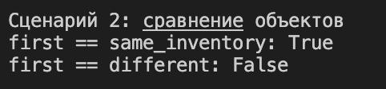
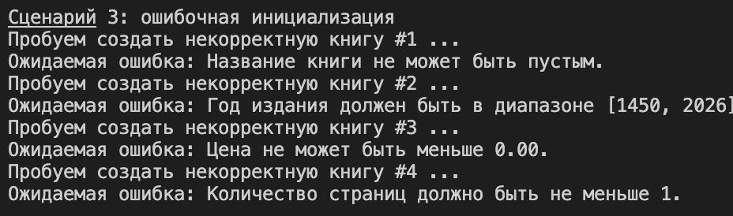
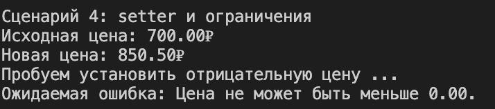
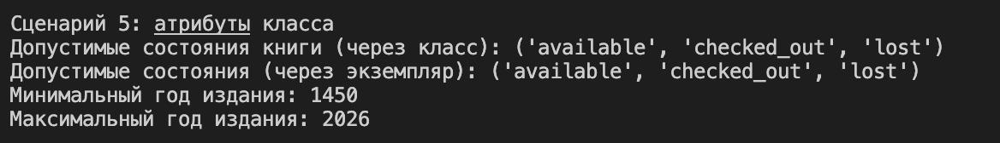
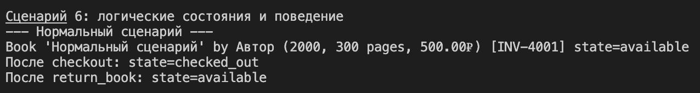

# Лабораторная работа №1
## Тема: ООП в Python. Класс `Book`

### Идея работы
В рамках лабораторной реализован класс `Book`, который описывает книгу в библиотечной системе.
Модель хранит основные данные о книге (название, автор, год, страницы, цена, инвентарный номер),
поддерживает логические состояния экземпляра и контролирует корректность входных данных через валидацию.

### Цели лабораторной работы
- Научиться создавать пользовательские классы в Python
- Закрепить инкапсуляцию через закрытые поля (`_attribute`)
- Реализовать доступ к данным через `@property` и `setter`
- Переопределить магические методы (`__str__`, `__repr__`, `__eq__`)
- Понять отличие атрибутов класса от атрибутов экземпляра

### Класс `Book`

Атрибуты класса:
- `ALLOWED_STATES` — допустимые состояния книги
- `MIN_YEAR`, `MAX_YEAR` — диапазон года издания
- `MIN_PRICE` — минимальная цена
- `MIN_PAGES` — минимальное количество страниц

Закрытые поля:
- `_title`, `_author`, `_year`, `_pages`, `_price`
- `_inventory_id` — инвентарный номер
- `_state` — текущее состояние (`available` / `checked_out` / `lost`)

Свойства `@property`:
- Только чтение: `title`, `author`, `year`, `pages`, `inventory_id`, `state`
- Чтение и запись: `price` (через setter с проверкой)

Магические методы:
- `__str__` — удобный человекочитаемый вывод
- `__repr__` — подробное представление для разработки и отладки
- `__eq__` — сравнение книг по `inventory_id`

Бизнес-методы:
- `checkout()` — выдать книгу
- `return_book()` — вернуть книгу
- `mark_lost()` — отметить как утерянную

### Отдельный модуль валидации
Проверки входных данных вынесены из модели в `validate.py`.
В файле размещены функции:
- `validate_title`
- `validate_author`
- `validate_year`
- `validate_pages`
- `validate_price`
- `validate_state`
- `validate_inventory_id`

Такое разделение делает модель проще, а валидацию — переиспользуемой и более удобной для тестирования.

## Демонстрация работы (`demo.py`)

Сценарий 1: Корректное создание и вывод
- Создаётся валидный объект `Book`
- Показывается вывод через `print(book)` и `repr(book)`

Подтверждает, что объект создаётся корректно, а магические методы форматируют вывод по назначению.

Сценарий 2: Сравнение объектов
- Создаётся две книги с одинаковым `inventory_id`
- Создаётся книга с другим `inventory_id`
- Выполняется сравнение через `==`

Показывает, что логика `__eq__` основана на инвентарном номере как на идентификаторе экземпляра.

Сценарий 3: Ошибки при создании
- Пустое название
- Год вне диапазона
- Отрицательная цена
- Нулевое число страниц

Демонстрирует обработку ошибок валидации и защиту модели от некорректных данных.

Сценарий 4: Setter для цены
- Чтение начальной цены
- Установка корректного нового значения
- Попытка задать отрицательную цену

Иллюстрирует работу `@property` + `setter` и контроль корректности при изменении поля.

Сценарий 5: Атрибуты класса
- Вывод `ALLOWED_STATES` через класс и через объект
- Вывод ограничений `MIN_YEAR` и `MAX_YEAR`

Показывает, что атрибуты класса являются общими для всех экземпляров.

Сценарий 6: Переходы состояний книги
- Нормальная цепочка: `available -> checked_out -> available`
- Невалидный переход: повторный `checkout()`
- Сценарий утери: `mark_lost()` и попытка выдать утерянную книгу

Подтверждает работу бизнес-правил и ограничений переходов между состояниями.