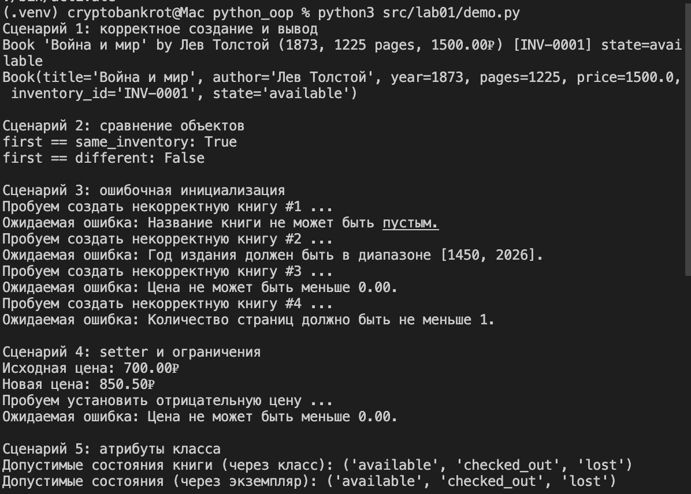

# лабараторная работа №1

**классы все дела**

__str__ - для вывода прочтения текста, который выводится в человеческом формате
__repr__ - для разработчиков, вывод в удобном для дебага формате
__eq__ - определяет как сравнивать объекты оператором ==

изменения атрибута класса скажется на всех экземплярах, по простому это изменение общего типа, допустим мы добавим переменную цвет и поставим ее равной green, то все экземпляры класса(книги в моем случае) станут зелеными(в частности имею в виду обложжку, не страницы)

а изменение экземпляра класса повлияет только на конкретный объект

@property - говорит, что метод - поле, которое доступно только для чтения, позволяет обращаться как к атрибуту(book.title)

