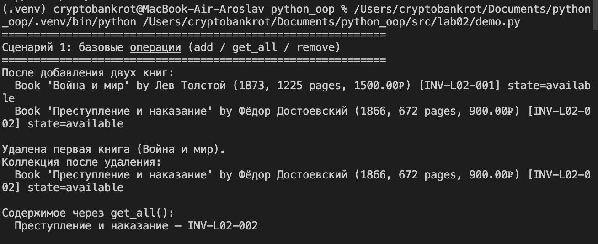
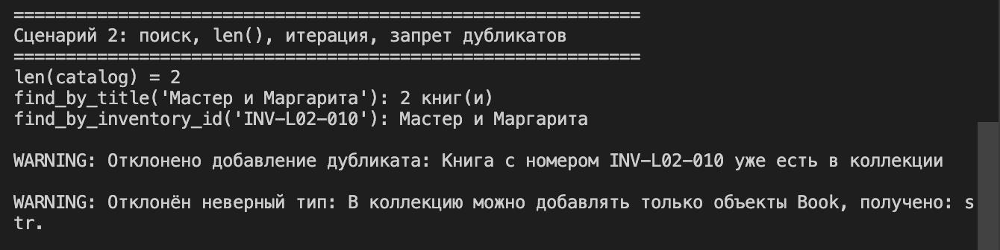
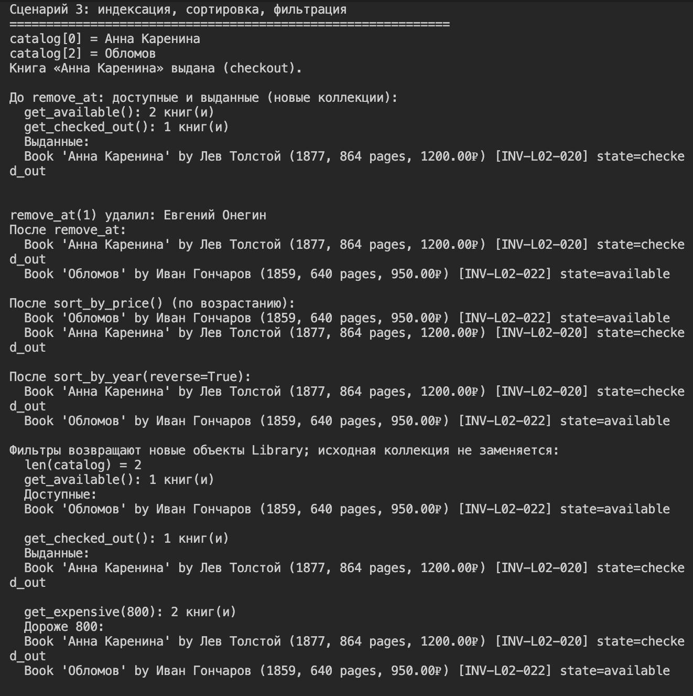

# Лабораторная работа №2
## Тема: коллекция объектов. Класс `Library`

### Идея работы
В рамках лабораторной реализован контейнер `Library`, который хранит множество объектов `Book` из [ЛР-1](../lab01/README.md)
Коллекция отделена от модели сущности: `Book` описывает одну книгу, `Library` управляет группой книг (добавление, удаление, поиск, сортировка, выборки по условиям)

### Цели лабораторной работы
- Научиться работать с коллекциями объектов и отличать модель сущности от контейнера
- Реализовать собственный контейнерный класс с внутренним списком `self._items`
- Освоить итерацию и доступ по индексу (`__iter__`, `__getitem__`, `__len__`)
- Реализовать поиск по атрибутам, ограничение на дубликаты и сортировку
- Реализовать логические выборки, возвращающие новую коллекцию

### Класс `Library`

Внутреннее хранение:
- `self._items` — список объектов `Book`

Базовые операции:
- `add(item)` — добавить книгу (проверка типа `Book`, запрет второй книги с тем же `inventory_id`)
- `remove(item)` — удалить книгу по ссылке на объект
- `get_all()` — вернуть копию списка всех книг

Поиск и перечисление:
- `find_by_title(title)` — список книг с данным названием
- `find_by_inventory_id(inventory_id)` — одна книга или `None`
- `__len__()` — число книг в коллекции
- `__iter__()` — итерация `for book in library`

Индексация и порядок:
- `__getitem__(index)` — доступ `library[i]`
- `remove_at(index)` — удалить книгу по индексу, вернуть удалённый объект
- `sort(key, reverse=False)` — универсальная сортировка на месте
- `sort_by_title()`, `sort_by_price()`, `sort_by_year()` — сортировка по полям

Логические выборки (возвращают **новый** объект `Library` с теми же экземплярами `Book`):
- `get_available()` — книги в состоянии «доступна»
- `get_checked_out()` — книги в состоянии «выдана»
- `get_expensive(min_price)` — книги с ценой не ниже порога

### Модуль `model.py` в ЛР-2
Модель книги не дублируется: в `model.py` выполняется реэкспорт `Book`, `BookState` и `BookValidationError` из [ЛР-1](../lab01/model.py), чтобы коллекция опиралась на уже согласованную с лабораторной работой №1 реализацию

### Исключения коллекции
Проверки операций коллекции оформлены отдельными исключениями:
- `LibraryError` — базовый класс
- `LibraryTypeError` — неверный тип при `add` / `remove`
- `DuplicateBookError` — попытка добавить книгу с уже существующим `inventory_id`
- `BookNotFoundError` — книга не найдена при `remove`

## Демонстрация работы (`demo.py`)

Сценарий 1: Базовые операции коллекции
- Создаются две книги `Book`
- Добавляются в `Library`, выводится содержимое
- Удаляется одна книга, коллекция выводится снова

Подтверждает работу `add`, `remove`, `get_all` и корректное хранение только объектов `Book`

Сценарий 2: Поиск, длина, итерация, запрет дубликатов
- Используются `find_by_title`, `find_by_inventory_id`, `len(library)` и цикл `for`
- Демонстрируется отклонение дубликата по `inventory_id` и отклонение объекта неправильного типа

Показывает требования уровня поиска по атрибутам, `__len__`, `__iter__` и ограничение на повторяющийся идентификатор

Сценарий 3: Индексация, сортировка, фильтрация
- Доступ по индексу `library[i]`, удаление `remove_at`
- Сортировка по цене и году
- Выдача книги (`checkout`), затем выборки `get_available`, `get_checked_out`, `get_expensive`

Иллюстрирует индексацию, сортировку и возврат новых коллекций при фильтрации без подмены исходного `Library`
