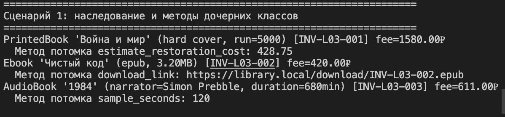
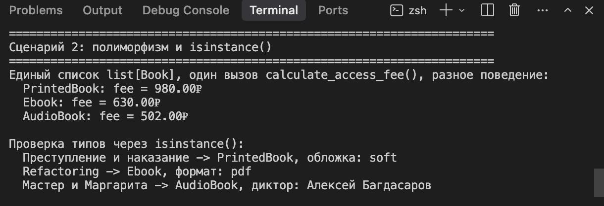
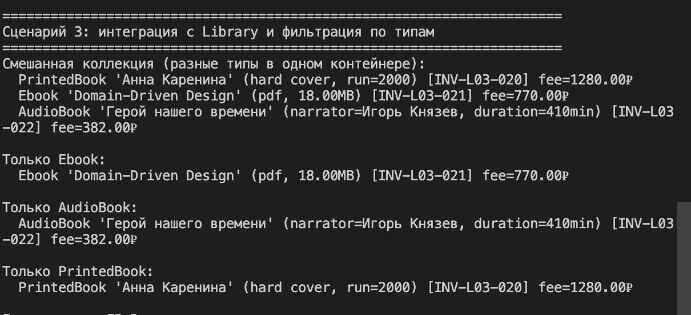

# ЛР-3 — Наследование и иерархия классов

## 1. Цель работы

В лабораторной работе реализовано наследование на базе модели `Book` из ЛР-1, построена иерархия классов, добавлено полиморфное поведение и интеграция с коллекцией из ЛР-2.

## 2. Описание реализованной иерархии классов

### Базовый класс

- `Book` (`src/lab03/base.py`)
  - содержит общие атрибуты книги: `title`, `author`, `year`, `pages`, `price`, `inventory_id`, `state`;
  - содержит общие бизнес-методы (`checkout`, `return_book`, `mark_lost`);
  - содержит общий интерфейс поведения `calculate_access_fee()`.

### Дочерние классы

- `PrintedBook` (`src/lab03/models.py`)
  - новые атрибуты: `cover_type`, `print_run`;
  - новый метод: `estimate_restoration_cost()`;
  - переопределены: `__str__`, `calculate_access_fee()`.

- `Ebook` (`src/lab03/models.py`)
  - новые атрибуты: `file_format`, `file_size_mb`;
  - новый метод: `download_link()`;
  - переопределены: `__str__`, `calculate_access_fee()`.

- `AudioBook` (`src/lab03/models.py`)
  - новые атрибуты: `duration_minutes`, `narrator`;
  - новый метод: `sample_seconds()`;
  - переопределены: `__str__`, `calculate_access_fee()`.

### Общие утилиты

- `src/lib/book_validators.py` — общие функции валидации (без дублирования в классах).

## 3. Демонстрация работы

Файл: `src/lab03/demo.py`

Реализованы сценарии:

1. **Наследование и методы потомков**
   - создание `PrintedBook`, `Ebook`, `AudioBook`;
   - вызов методов базового и дочерних классов.
   

2. **Полиморфизм и проверка типов**
   - единый список `list[Book]` с разными потомками;
   - вызов `calculate_access_fee()` без условного ветвления по типу;
   - проверка типов через `isinstance()`.
   

3. **Интеграция с коллекцией (ЛР-2)**
   - хранение смешанного набора наследников в `Library`;
   - фильтрация по типу: `get_only_ebooks()`, `get_only_audio_books()`, `get_only_printed()`.
   

## 4. Вывод

В ходе работы изучены и применены:

- наследование и построение иерархии;
- переопределение методов базового класса;
- полиморфизм через единый интерфейс;
- интеграция и работа с коллекцией смешанных типов.

