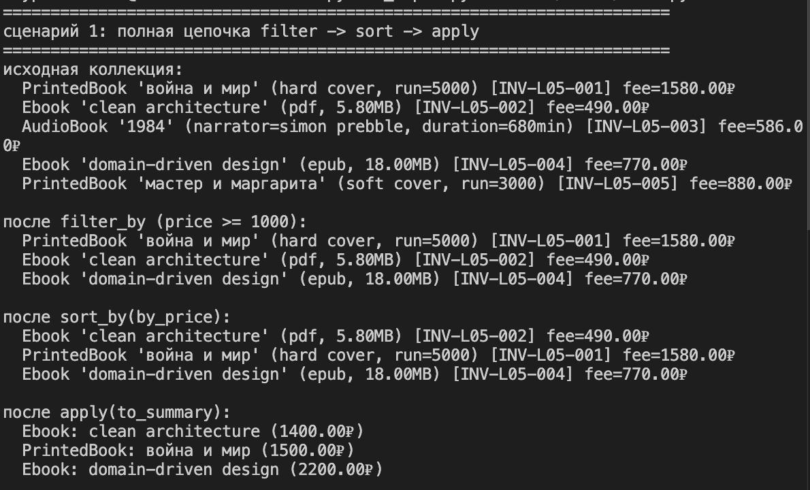
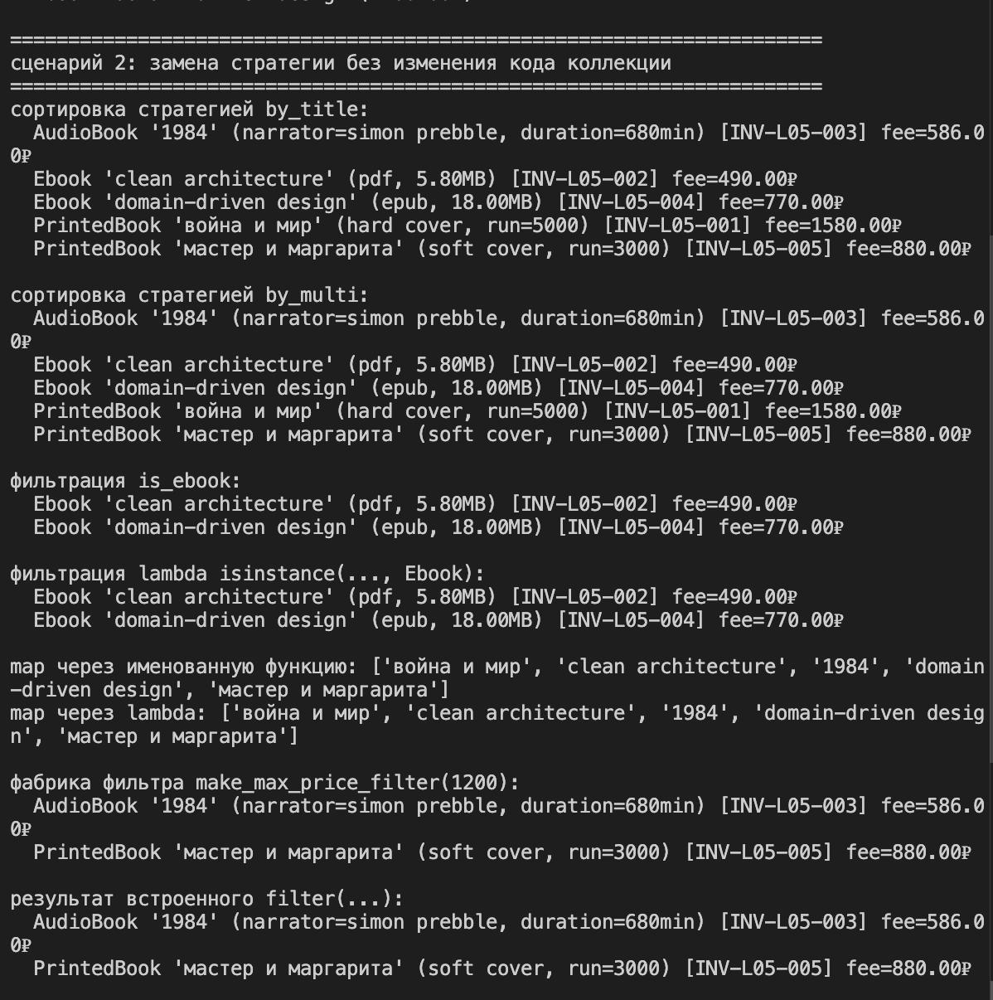
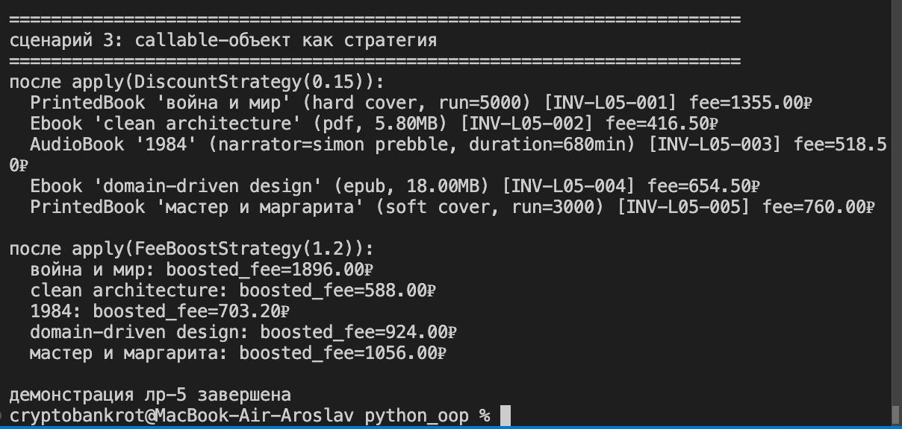

# ЛР-5 — функции как аргументы, стратегии и делегаты

## 1. цель работы

в лабораторной работе изучена передача функций как аргументов, применение map/filter/sorted, фабрика функций и паттерн стратегия через callable-объекты

## 2. реализованные функции и стратегии

в `src/lab05/strategies.py` реализованы:

- стратегии сортировки:
  - `by_title`
  - `by_price`
  - `by_multi`
- функции-фильтры:
  - `is_expensive`
  - `is_ebook`
- функции для преобразования через `map`:
  - `to_title`
  - `to_summary`
- фабрика функций:
  - `make_max_price_filter(max_price)`
- callable-стратегии:
  - `DiscountStrategy`
  - `FeeBoostStrategy`

все функции и классы снабжены docstring

## 3. коллекция и chain api

в `src/lab05/collection.py` реализован `BookCollection`:

- `sort_by(key_func, reverse=False)`
- `filter_by(predicate)`
- `apply(func)`

методы возвращают новую коллекцию, поэтому поддерживается цепочка операций:

`filter -> sort -> apply`

## 4. демонстрация работы

файл: `src/lab05/demo.py`

сценарий 1:
- полная цепочка `filter -> sort -> apply`
- вывод результатов на каждом шаге

сценарий 2:
- замена стратегии сортировки без изменения кода коллекции
- сравнение именованной функции и `lambda`
- использование `map`, `filter` и фабрики фильтра

сценарий 3:
- callable-объекты как взаимозаменяемые стратегии
- применение через `collection.apply(...)`

## 5. вывод

в ходе работы закреплены:

- передача функций как аргументов
- lambda, map, filter, sorted
- функции высшего порядка и замыкания
- паттерн стратегия и callable-объекты

