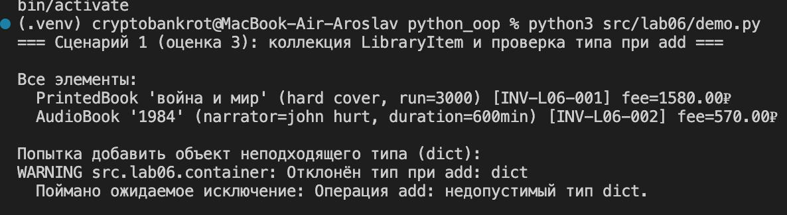
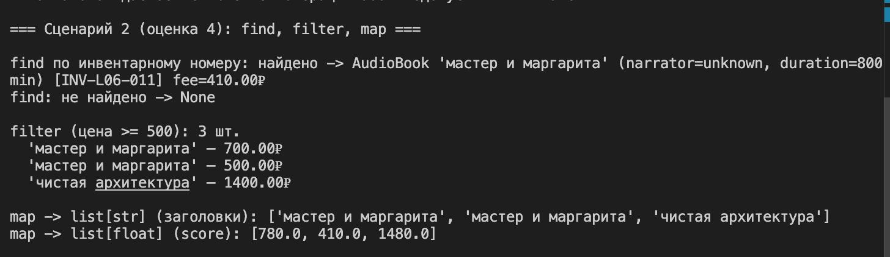
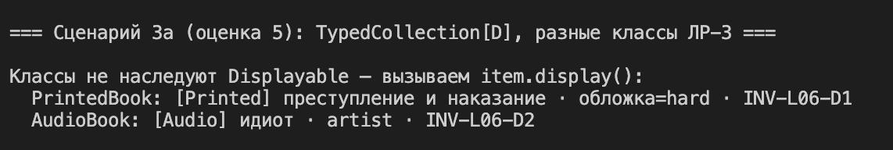
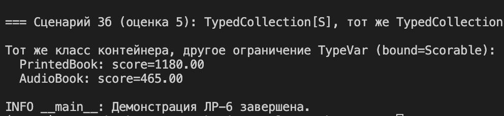

# ЛР-6 — Generics и typing

## 1. Цель работы

Закрепить использование аннотаций типов в Python, обобщённые классы на базе `TypeVar` и `Generic`, а также структурную типизацию через `typing.Protocol` и ограничения `bound=`.

## 2. Описание реализованных типов и контейнеров

### Generic-класс `TypedCollection` (`src/lab06/container.py`)

Типизированная коллекция с тем же публичным контрактом, что и `Library` из ЛР-2 (`src/lab02/collection.py`): добавление и удаление, поиск по названию и инвентарному номеру, итерация, сортировки, выборки по состоянию и цене, фильтрация по типам наследников ЛР-3, выборки `get_printable` / `get_comparable` (ЛР-4). Дополнительно реализованы методы **`find`**, **`filter`**, **`map`** с корректными аннотациями.

Опционально в конструктор передаётся `allowed_item_type`: при `add` / `remove` выполняется проверка `isinstance`; при несоответствии выбрасывается `LibraryTypeError` (типы исключений взяты из ЛР-2). Для сценария «как в библиотеке» можно использовать `TypedCollection.default_library_book_types()` — кортеж `(Book из ЛР-1, Book из ЛР-3)`.

### TypeVar

| Имя | Назначение |
|-----|------------|
| `T` | Элемент обобщённой коллекции `TypedCollection[T]`. |
| `R` | Результат преобразования в методе `map` (может отличаться от `T`). |
| `D` | `TypeVar("D", bound=Displayable)` — только объекты с методом `display()`. |
| `S` | `TypeVar("S", bound=Scorable)` — только объекты с методом `score()`. |

### Протоколы

- **`LibraryItem`** — внутренний протокол полей книги (`title`, `inventory_id`, `state`, `price`, `year`). Методы, которые к ним обращаются, аннотированы с сужением первого аргумента до `TypedCollection[LibraryItem]`, чтобы при `TypedCollection[Displayable]` статический анализатор не считал вызовы вроде `find_by_title` корректными.
- **`Displayable`** — метод `display() -> str`.
- **`Scorable`** — метод `score() -> float`.

Классы **`Book`** в ЛР-1 и иерархия **`Book` / `PrintedBook` / `Ebook` / `AudioBook`** в ЛР-3 **не наследуются** от этих протоколов; у них добавлены методы `display()` и `score()`, поэтому они **структурно** подходят под `Displayable` и `Scorable`.

## 3. Демонстрация работы

Файл: `src/lab06/demo.py`. Запуск из корня репозитория:

```bash
python3 -m src.lab06.demo
```

Сценарии:

1. **`TypedCollection[LibraryItem]`** с `allowed_item_type`, вывод всех элементов, попытка добавить `dict` и перехват `LibraryTypeError`.
2. **`find`** (найдено / `None`), **`filter`**, два вызова **`map`** с разными типами результата: `list[str]` и `list[float]`.
3. **`TypedCollection[D]`** — `PrintedBook` и `AudioBook`, вывод `display()` для каждого типа без наследования от `Protocol`.
4. **`TypedCollection[S]`** — тот же класс контейнера, ограничение `bound=Scorable`, вывод `score()`.

Скриншоты вывода терминала (после запуска команды выше):

- 
- 
- 
- 


## 4. Вывод

В ходе работы закреплены:

- роль аннотаций типов для читаемости и поддержки кода;
- обобщённые классы `Generic` и параметры `TypeVar`, в том числе с ограничением `bound`;
- `Protocol` как структурный контракт без наследования;
- сочетание универсального контейнера с разными ограничениями типов в разных сценариях.
